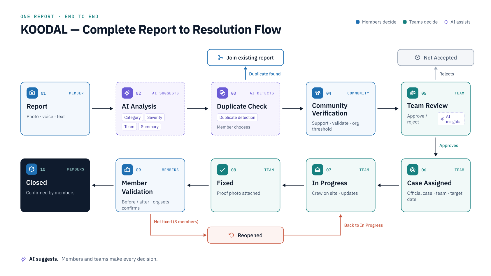
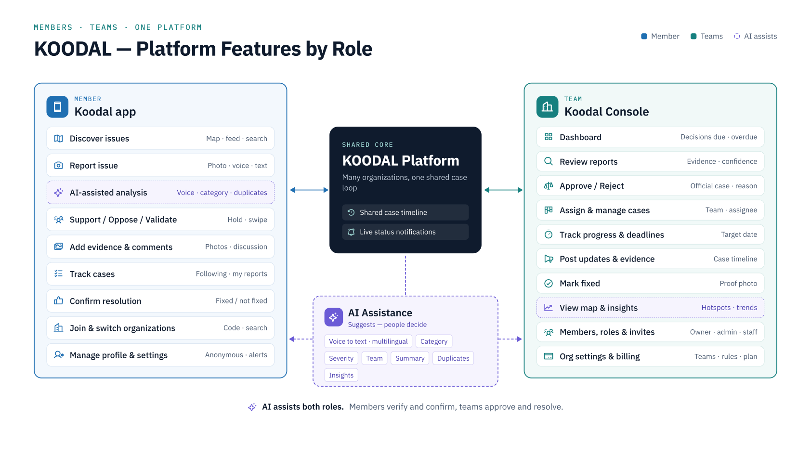
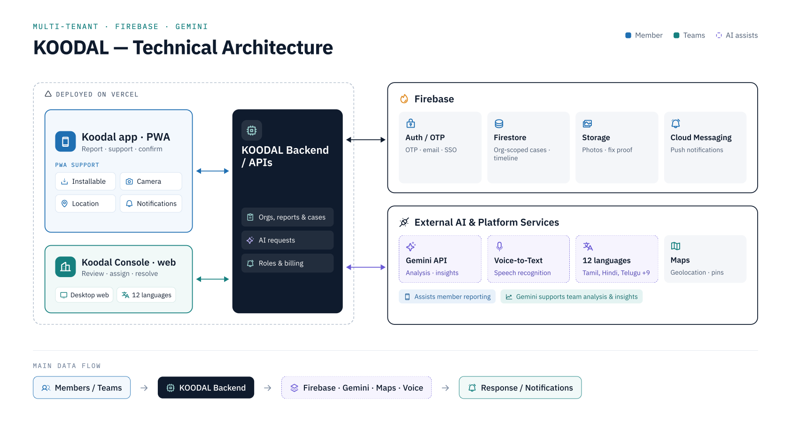

<div align="center">


# KOODAL · கூடல்

### One platform where any community **reports, verifies and resolves** its issues, in the open.


[](https://ungakoodal.vercel.app/pitch)
[](https://ungakoodal.vercel.app)
[](#-submission-checklist)

**🌐 Live: [ungakoodal.vercel.app](https://ungakoodal.vercel.app) · 💻 Source: [github.com/triozcompany/koodal](https://github.com/triozcompany/koodal)**

**Built by TEAM TRIOZ for [Build with AI: Code for Communities](https://hack2skill.com/event/codeforcommunities2)**

</div>

---

## 🏆 Hackathon

| | |
|---|---|
| **Event** | Build with AI: Code for Communities, a Google Cloud hackathon by GDG India on Hack2Skill |
| **Theme** | Solving for India: Indian developers, Indian problems, Indian scale |
| **Track** | **01 · AI for Digital Public Infrastructure & Governance** (Innovation) |
| **Prize pool** | INR 10 lakh + Google Cloud credits for top teams |
| **Register / details** | [hack2skill.com/event/codeforcommunities2](https://hack2skill.com/event/codeforcommunities2) |

> **The challenge:** governments struggle to consolidate citizen feedback and align it with infrastructure priorities. Requests live in fragmented systems, so spending is misaligned and gaps go unaddressed. Build a scalable, multilingual AI platform, designed as a Digital Public Good, that aggregates citizen requests and surfaces demand hotspots for policymakers.

## 💡 What is Koodal?

**One open loop for every community's issues.** Koodal is a multi-tenant platform where any organization (a city corporation, an apartment community, a university or an institution) gets its own space to report, verify, fix and confirm local issues.

| | |
|---|---|
| 🗣 **Members report and support** | Report in your own language by photo, text or voice note through the Koodal app. Neighbours support and verify, so the most important issues rise to the top. |
| 🛠 **The team decides and fixes** | Staff use the Koodal Console to accept or reject cases, assign the right team, track deadlines and post proof of the fix. |
| ✅ **The community confirms** | A case closes only when the people who reported it agree it's fixed. Otherwise it reopens. |

**What makes it different**
- **Built-in AI (Gemini):** turns voice notes in Tamil, Hindi and Tanglish into structured reports, merges duplicates into one case, and suggests category, severity and team. Staff always make the final decision.
- **One product for every organization:** wording, categories, teams and joining rules adapt to a government, an apartment, a campus or an institution. One account works across all of them, with instant switching.
- **Trust built in:** a public case timeline, community verification and closure only on members' confirmation.
- **Built for India:** 12 Indian languages, UPI AutoPay and GST invoicing.

**Impact:** people get a voice and see what happens to their reports. Organizations get fewer duplicates, clear priorities and data on which problems keep coming back.

This repo is the hackathon MVP (originally named CivicPulse), focused on the civic / government use case for Tamil Nadu. See [Built vs roadmap](#built-vs-roadmap) for what is implemented today.

**📖 [View the pitch deck](https://ungakoodal.vercel.app/pitch) in the app, or [download the PDF](https://ungakoodal.vercel.app/docs/Koodal_Platform_Pitch_Deck.pdf)** (also in the repo: [`public/docs/Koodal_Platform_Pitch_Deck.pdf`](public/docs/Koodal_Platform_Pitch_Deck.pdf)).

## 🔁 The loop

The full flow diagram is in [Architecture](#-architecture) below.


1. **Report:** a photo, in the member's own language (the deck targets 12 Indian languages).
2. **AI suggests:** category, summary, severity and the department it goes to.
3. **AI detects:** similar nearby issues are flagged so duplicates are merged, not re-filed.
4. **Community supports:** neighbours upvote and add evidence. Crossing the verification threshold (80%) opens an official case.
5. **Team acts:** pending approval → assigned → in progress, with SLA breaches shown on the public case timeline.
6. **Members confirm:** before/after proof is posted and neighbours vote *Fixed* or *Not yet*. A rejected fix reopens the case.

## 🧠 How Google AI is used

| Where | What | Status |
|---|---|---|
| Gemini (`@google/generative-ai`, `lib/gemini.ts`) | Classify a report: category, severity, department, title, summary | ✅ Built |
| Gemini | Similar-issue / duplicate matching against nearby cases | ✅ Built |
| Google Maps Platform, BigQuery, Speech-to-Text, Translation API | Demand hotspots, voice and messaging intake, multilingual UI at national scale | 🗺 Roadmap |

## 🎯 Judging criteria → Koodal

| Weight | Criterion | Koodal's answer |
|---|---|---|
| 20% | Problem–solution fit | Turns scattered citizen complaints into verified, prioritized, tracked cases |
| 25% | AI / technical execution | Gemini classification and dedup wired into a working end-to-end report flow on Firestore |
| 20% | Depth & reach across India | Multi-tenant by design: any organization type, any language, any state |
| 15% | Impact potential | Community verification plus public SLA timelines make outcomes measurable |
| 20% | Deployability & scalability | Small stack (Next.js, Firebase, Gemini), deployable on Vercel or Cloud Run, PWA-ready |

## 🏗 Architecture

Diagrams from the [pitch deck](https://ungakoodal.vercel.app/pitch).

### 1 · Complete report-to-resolution flow



### 2 · Platform features by role



### 3 · Technical architecture



## 🔗 Live routes

| Route | What it is |
|---|---|
| [`/`](https://ungakoodal.vercel.app/) | Landing page |
| [`/get-started`](https://ungakoodal.vercel.app/get-started) | Create an organization |
| [`/pitch`](https://ungakoodal.vercel.app/pitch) | Pitch deck viewer with PDF download ([PDF](https://ungakoodal.vercel.app/docs/Koodal_Platform_Pitch_Deck.pdf)) |
| [`/nearby`](https://ungakoodal.vercel.app/nearby) | Citizen app: nearby issues on a map |
| [`/feeds`](https://ungakoodal.vercel.app/feeds) | Citizen app: feed |
| [`/search`](https://ungakoodal.vercel.app/search) | Citizen app: search |
| [`/cases`](https://ungakoodal.vercel.app/cases) | Citizen app: cases |
| [`/profile`](https://ungakoodal.vercel.app/profile) | Citizen app: profile |
| [`/settings`](https://ungakoodal.vercel.app/settings) | Citizen app: settings |

## 🧩 Product model

- **Members** report, support and verify issues. Members never pay.
- **Teams** (staff, admins, owner) review cases, assign work and post proof of the fix, with role-based access.
- **Organizations** subscribe by type: Government, Apartment or community, University or campus, Institution.
- **Platform admin** sees every tenant, its plan and its health; every action is audit-logged.

Plans and pricing are in [Business model & growth](#-business-model--growth) below.

## 📈 Business model & growth

**Organizations subscribe. Members never pay.** Priced by community size, at about ₹2–10 per member a month. Every plan starts with a 14-day free trial.

| Plan | Price | Limits | Who it's for |
|---|---|---|---|
| Starter | ₹999 / month | 100 members · 2 staff | Small apartments, clubs |
| Community | ₹2,499 / month | 500 members · 5 staff | Gated communities, schools |
| Institution | ₹6,999 / month | 3,000 members · 15 staff | Colleges, hospitals, offices |
| Civic | Custom / year | Unlimited · SSO · open data | Cities and large campuses |

### 3-year growth plan

| | Year 1 | Year 2 | Year 3 |
|---|---|---|---|
| **Annual recurring revenue** | **₹30 L** | **₹1 Cr** | **₹2.7 Cr** |
| Organizations | 73 | 271 | 735 |
| Footprint | 2 city pilots | 6 cities | 15 cities |

_These are targets, not results._

**How it grows**
- **Upgrades as communities grow:** plans are sized by members, so revenue grows with each org.
- **Members bring the next org:** one account across communities keeps acquisition cheap.
- **Add-ons:** WhatsApp and IVR reporting, SMS alerts, open-data exports.
- **Civic contracts anchor revenue:** yearly city deals, averaging about ₹7.8 L each.

> The platform-admin figures in the deck (8 paying organizations, ₹2.32 L MRR) come from demo/sample data, not real customers.

### Built vs roadmap

| ✅ Built in this repo | 🗺 Roadmap (shown in the deck) |
|---|---|
| Citizen app: nearby map and list, feed, search, cases, report flow, duplicate handling, profile, settings | Team/government workflow screens on live data |
| Gemini report analysis, Firestore persistence, email/password auth | Multi-tenant organizations, billing, platform admin |
| | Voice / WhatsApp intake, 12-language UI, policymaker hotspot analytics |

## 🗓 Hackathon timeline

| Date (2026) | Milestone |
|---|---|
| 11 Aug – 30 Sep | Registration, team formation and prototype submission |
| 1 – 15 Oct | Prototype evaluation |
| 16 Oct | Top 20 shortlist announced |
| 23 Oct | Virtual Demo Day |
| Oct (TBA) | In-person Demo Day |

## ✅ Submission checklist

- [x] Source code: [github.com/triozcompany/koodal](https://github.com/triozcompany/koodal)
- [x] Pitch deck: [`public/docs/Koodal_Platform_Pitch_Deck.pdf`](public/docs/Koodal_Platform_Pitch_Deck.pdf) (20 slides, also at [`/pitch`](https://ungakoodal.vercel.app/pitch))
- [ ] Demo video (3–5 min): _TODO_
- [x] Deployed link: [ungakoodal.vercel.app](https://ungakoodal.vercel.app)
- [x] Short description: see [below](#submission-description)

### Submission description

> Koodal is a multi-tenant platform where any organization (city corporation, apartment, university or institution) gets its own space to report, verify, fix and confirm local issues.
>
> Members report problems by photo, text or voice in 12 Indian languages via the Koodal app. Neighbours support and verify reports so urgent issues rise. Staff use the Koodal Console to accept, assign and track cases against deadlines, then post proof of the fix. A case closes only when the community confirms it; otherwise it reopens.
>
> Gemini AI turns Tamil/Hindi voice notes into structured reports, merges duplicates and suggests category, severity and team; staff always make the final decision. One account works across many organizations, and the app adapts its wording, categories and teams to each.
>
> Organizations subscribe monthly (from ₹999) after a 14-day free trial; members never pay.
>
> Built with Next.js, Firebase, Gemini and Google Maps by Team TRIOZ.

## 👥 Team TRIOZ

| | Member | Role | Links |
|---|---|---|---|
| 🧭 | **Santhosh S** | Team Leader | [GitHub](https://github.com/itzthesandy) · [LinkedIn](https://www.linkedin.com/in/itzthesandy) |
| 💻 | **Aakash T** | Team Member | [GitHub](https://github.com/CyberAakash) · [LinkedIn](https://www.linkedin.com/in/cyberaakash/) |

---|---|---|
| 🧭 | **Santhosh S** | Team Leader |
| 💻 | **Aakash T** | Team Member |

---

## Getting started

```bash
npm install
cp .env.example .env.local   # then fill in real values, see below
```

You'll also need a Firebase Admin service account for local development — see [Environment & secrets](#environment--secrets).

```bash
npm run dev
```

Open [http://localhost:3000](http://localhost:3000).

To (re)seed sample Firestore data:

```bash
npx tsx scripts/seed-koodal.ts
```

## Environment & secrets

Nothing secret is committed to this repo. Copy `.env.example` to `.env.local` and fill in:

| Variable | Used for | Get it from |
|---|---|---|
| `GEMINI_API_KEY` | AI report analysis (`lib/domain/analyze.ts`) | https://aistudio.google.com/apikey |
| `FIREBASE_SERVICE_ACCOUNT_JSON` | Server-side Firestore writes (deploy-time alternative to a local key file) | Firebase Console → Project Settings → Service Accounts |

For **local development**, `lib/firebase/admin.ts` prefers a JSON key file over the env var:

```
secret/<project-id>-firebase-adminsdk-*.json
```

Download this from Firebase Console → Project Settings → Service Accounts → *Generate new private key*, and drop it in `secret/`. That whole folder is gitignored except `secret/service-account.example.json`, which documents the expected shape — copy the real file in beside it, don't overwrite it.

For **deployment** (Vercel or similar), you generally can't ship that file — set `FIREBASE_SERVICE_ACCOUNT_JSON` as a platform environment variable instead, pasting the entire service-account JSON as a single-line string. If neither the file nor the env var is present, `admin.ts` falls back to `gcloud auth application-default login` (ADC), which only works for local development.

The Firebase **client** (web) config in `lib/firebase/client.ts` is not secret — Firebase web API keys are safe to expose publicly; access is enforced by Firestore security rules, not by hiding that key. It's already committed as literal values; only change it if you're pointing this app at a different Firebase project.

## Project structure

- `app/(marketing)/` — the public site: landing [`/`](https://ungakoodal.vercel.app/), [`/get-started`](https://ungakoodal.vercel.app/get-started) and the pitch deck viewer [`/pitch`](https://ungakoodal.vercel.app/pitch) with PDF download (`public/docs/`).
- `app/(citizen)/` — the citizen-facing app (Next.js App Router), one route folder per screen (`feeds/`, `search/`, `cases/`, `issues/[issueId]/`, `profile/`, `settings/`, etc.), each typically split into a mobile `*Screen.tsx` and a desktop `Desktop*.tsx`.
- `lib/domain/` — pure domain logic and types shared across screens (stages, filters, scoring, dedup, etc.), no framework or I/O dependencies.
- `lib/firebase/` — Firestore client SDK (`client.ts`) and Admin SDK (`admin.ts`) setup.
- `server/actions/` — Next.js Server Actions that perform the actual Firestore writes.
- `design_handoff_koodal/` — the design source of truth (interactive prototype + per-screen markup/logic slices) that the citizen UI is ported from.
- `scripts/seed-koodal.ts` — seeds sample issues/cases into Firestore for local development and demos.

## Scripts

| Command | Does |
|---|---|
| `npm run dev` | Start the dev server (Turbopack) |
| `npm run build` | Production build |
| `npm run start` | Run a production build |
| `npm run test` | Run the test suite (Vitest) |
