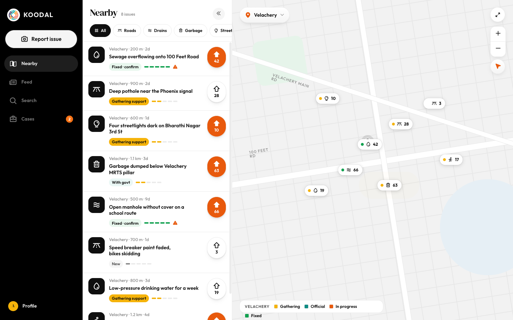
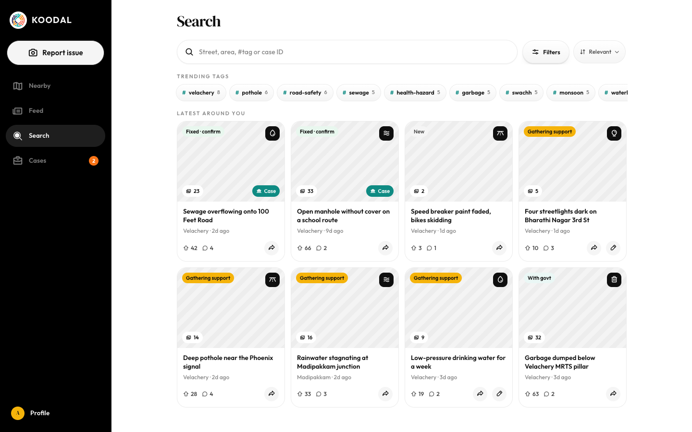
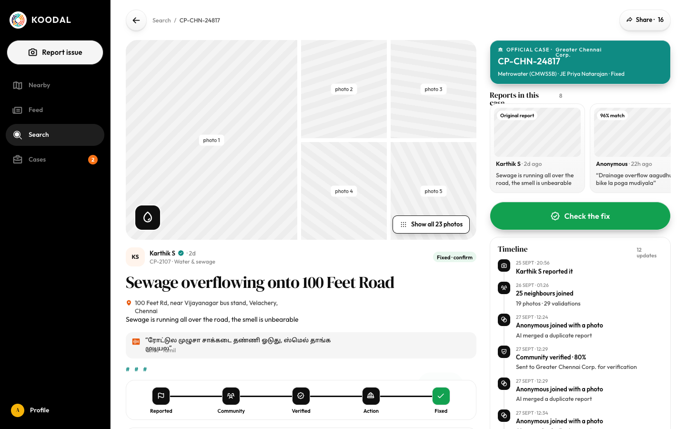
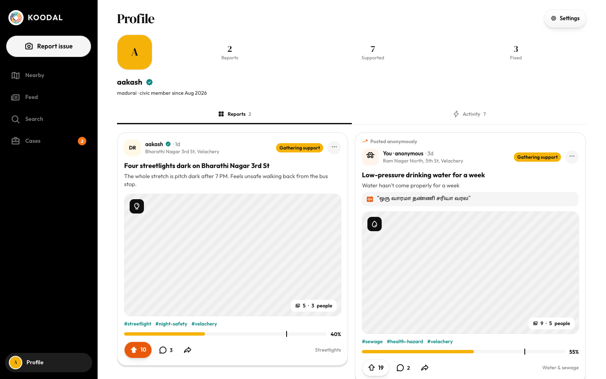
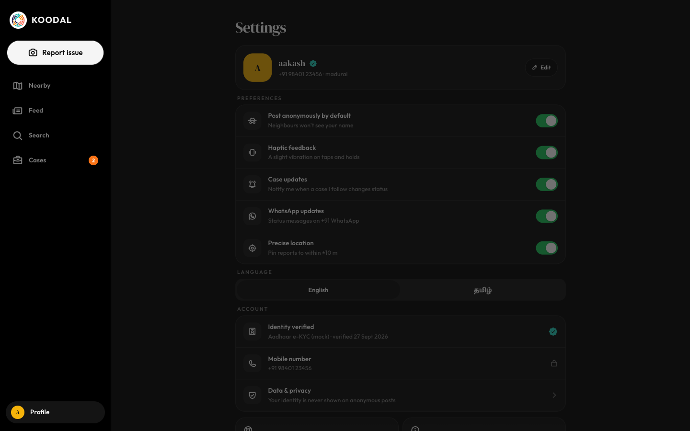

# Desktop left navigation rail

Source: `Koodal Citizen.dc.html`, block `<sc-if value="{{ railShown }}">`.

## Match these screenshots
-  `screenshots/citizen-desktop/01-home-map-list.png`
-  `screenshots/citizen-desktop/03-feed.png`
-  `screenshots/citizen-desktop/04-search.png`
-  `screenshots/citizen-desktop/05-issue-detail.png`
-  `screenshots/citizen-desktop/11-my-cases.png`
-  `screenshots/citizen-desktop/12-profile.png`
-  `screenshots/citizen-desktop/13-settings.png`

## Values used (from renderVals)
`railShown`, `railW`, `toggleRail`, `logoIn`, `logoOut`, `railTip`, `logoBg`, `logoCur`, `logoScale`, `dotO`, `dotS`, `railIcon`, `icoO`, `icoT`, `railLabels`, `sideX`, `goReport`, `dnav`, `goProfilePage`, `profNavBg`, `profRing`, `meI`

## Port rules
- Convert `markup.html` to JSX nearly 1:1. Keep every inline style value; `style-hover`/`style-active` → :hover/:active.
- `<sc-if value={{x}}>` → `{x && …}`; `<sc-for list={{xs}} as="x">` → `xs.map(x => …)`.
- Compute values exactly as in `logic.js`; handlers live in `../_shared/methods.js`.
- Screenshot-diff your page against the images above until < 1% difference.
