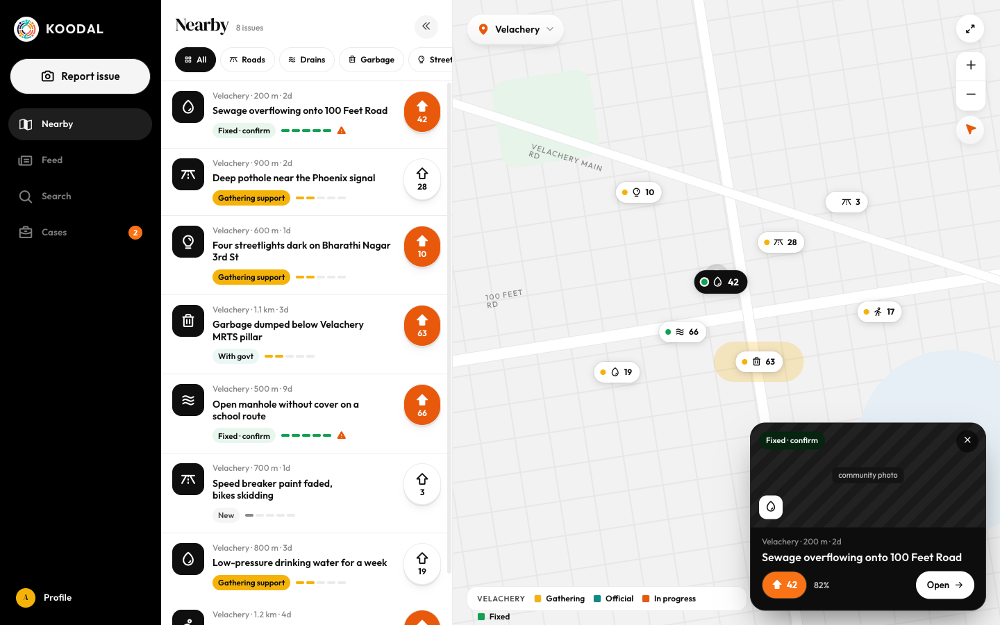

# Home: map + nearby list (desktop)

Source: `Koodal Citizen.dc.html`, block `<sc-if value="{{ deskHome }}">`.

## Match these screenshots
-  `screenshots/citizen-desktop/01-home-map-list.png`
-  `screenshots/citizen-desktop/02-home-issue-selected.png`

## Values used (from renderVals)
`deskHome`, `listW`, `dTitle`, `dCount`, `toggleList`, `chips`, `dlist`, `dEmpty`, `mapDown`, `mapWheel`, `mapCur`, `panX`, `panY`, `zoom`, `mapTr`, `showMe`, `dpins`, `pinInv`, `toggleMapFull`, `mapFullTip`, `mapFullIcon`, `zoomIn`, `zoomOut`, `recenter`, `listHidden`, `regionPill`, `regionName`, `mapCity`, `legend`, `hasSel`, `sel`, `closeSel`

## Port rules
- Convert `markup.html` to JSX nearly 1:1. Keep every inline style value; `style-hover`/`style-active` → :hover/:active.
- `<sc-if value={{x}}>` → `{x && …}`; `<sc-for list={{xs}} as="x">` → `xs.map(x => …)`.
- Compute values exactly as in `logic.js`; handlers live in `../_shared/methods.js`.
- Screenshot-diff your page against the images above until < 1% difference.
