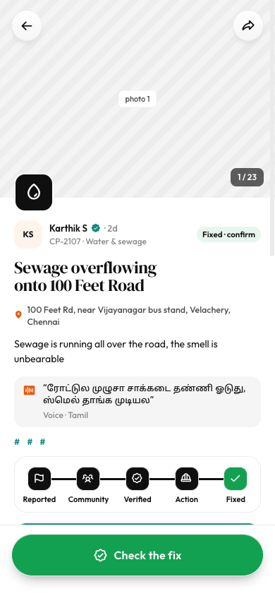

# Issue detail (mobile)

Source: `Koodal Citizen.dc.html`, block `<sc-if value="{{ isDetail }}">`.

## Match these screenshots
-  `screenshots/citizen-mobile/05-issue-detail.png`

## Values used (from renderVals)
`isDetail`, `carScroll`, `heroSlides`, `openTour`, `carN`, `d`, `goCase`, `addEvidence`, `back`, `editFlex`, `isMobile`, `shareFlex`, `oppFlex`, `holdStart`, `holdEnd`, `holdFlex`, `holdBg`, `holdFg`, `holdShadow`, `holdT`, `holdW`, `holdIcon`, `holdLabel`, `goVerify`

## Port rules
- Convert `markup.html` to JSX nearly 1:1. Keep every inline style value; `style-hover`/`style-active` → :hover/:active.
- `<sc-if value={{x}}>` → `{x && …}`; `<sc-for list={{xs}} as="x">` → `xs.map(x => …)`.
- Compute values exactly as in `logic.js`; handlers live in `../_shared/methods.js`.
- Screenshot-diff your page against the images above until < 1% difference.
