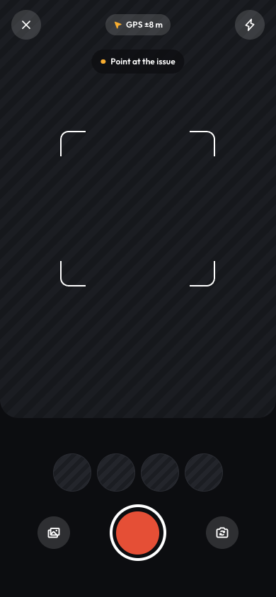

# Report: camera / upload, text or voice, tags, anonymous, slide to report

Source: `Koodal Citizen.dc.html`, block `<sc-if value="{{ isReport }}">`.

## Match these screenshots
-  `screenshots/citizen-mobile/06-report-capture.png`
-  `screenshots/citizen-desktop/06-report-upload.png`

## Values used (from renderVals)
`isReport`, `camH`, `camMode`, `captured`, `camHint`, `retake`, `shotList`, `canAddShot`, `addShot`, `flash`, `closeFlow`, `isMobile`, `isDesk`, `gallery`, `capture`, `uploadMode`, `cPadX`, `sceneStreet`, `setText`, `textBg`, `setVoice`, `voiceModeBg`, `isText`, `desc`, `onDesc`, `isVoice`, `voiceTap`, `voiceBg`, `voiceIcon`, `voiceIdle`, `voiceNotIdle`, `wave`, `voiceTag`, `voiceDone`, `an`, `selTags`, `tagDraft`, `onTagDraft`, `onTagKey`, `addTag`, `setNamed`, `namedBg`, `meI`, `meFirst`, `setAnon`, `anonBg`, `slideFillW`, `slideTextO`, `slideDown`, `slideXpx`, `slideTrans`

## Port rules
- Convert `markup.html` to JSX nearly 1:1. Keep every inline style value; `style-hover`/`style-active` → :hover/:active.
- `<sc-if value={{x}}>` → `{x && …}`; `<sc-for list={{xs}} as="x">` → `xs.map(x => …)`.
- Compute values exactly as in `logic.js`; handlers live in `../_shared/methods.js`.
- Screenshot-diff your page against the images above until < 1% difference.
