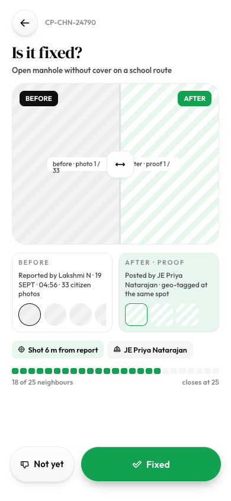

# Is it fixed? confirm / not fixed

Source: `Koodal Citizen.dc.html`, block `<sc-if value="{{ isVerify }}">`.

## Match these screenshots
-  `screenshots/citizen-mobile/10-verify-fix.png`
-  `screenshots/citizen-desktop/09-verify-fix.png`

## Values used (from renderVals)
`isVerify`, `goTimeline`, `flowBackIcon`, `d`, `splitDown`, `vaSel`, `splitW`, `vbSel`, `vbLine`, `vbThumbs`, `vaLine`, `vaThumbs`, `confirmDots`, `verifyOpen`, `notFixed`, `fixed`, `verifyClosed`, `verifyMsg`, `vFixed`, `sparks`, `fixedTitle`, `goCases`, `vNot`, `reasons`, `cancelNot`, `sendReopen`, `reopenO`

## Port rules
- Convert `markup.html` to JSX nearly 1:1. Keep every inline style value; `style-hover`/`style-active` → :hover/:active.
- `<sc-if value={{x}}>` → `{x && …}`; `<sc-for list={{xs}} as="x">` → `xs.map(x => …)`.
- Compute values exactly as in `logic.js`; handlers live in `../_shared/methods.js`.
- Screenshot-diff your page against the images above until < 1% difference.
