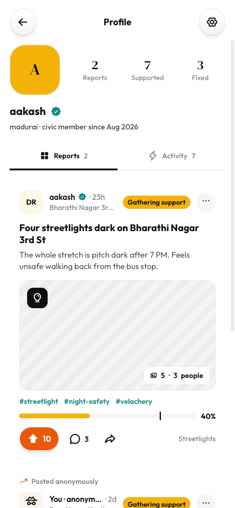

# Profile (mobile)

Source: `Koodal Citizen.dc.html`, block `<sc-if value="{{ isProfile }}">`.

## Match these screenshots
-  `screenshots/citizen-mobile/14-profile.png`

## Values used (from renderVals)
`isProfile`, `profBack`, `goSettings`, `meI`, `pStats`, `meName`, `meVerified`, `meArea`, `pTabs`, `pShowMine`, `pCols`, `pMine`, `postR`, `postB`, `postSh`, `stop`, `cDraft`, `onCDraft`, `onCKey`, `sendC`, `cSendO`, `pShowFeed`, `pFeed`, `pShowCases`, `gridCols`, `pCases`, `pShowAct`, `pActs`, `pEmpty`, `pEmptyTxt`

## Port rules
- Convert `markup.html` to JSX nearly 1:1. Keep every inline style value; `style-hover`/`style-active` → :hover/:active.
- `<sc-if value={{x}}>` → `{x && …}`; `<sc-for list={{xs}} as="x">` → `xs.map(x => …)`.
- Compute values exactly as in `logic.js`; handlers live in `../_shared/methods.js`.
- Screenshot-diff your page against the images above until < 1% difference.
