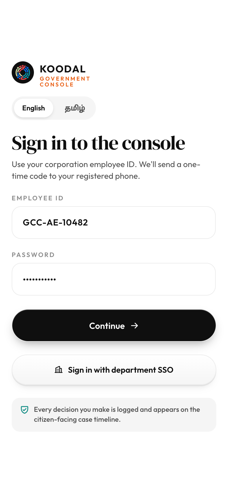

# Login: employee ID → OTP

Source: `Koodal Government.dc.html`, block `<sc-if value="{{ showLogin }}">`.

## Match these screenshots
-  `screenshots/gov-desktop/01-login-id.png`
-  `screenshots/gov-desktop/02-login-otp.png`
-  `screenshots/gov-mobile/01-login.png`

## Values used (from renderVals)
`showLogin`, `loginCols`, `loginSide`, `loginStats`, `loginMobHead`, `langOpts`, `lId`, `empId`, `onEmp`, `pwd`, `onPwd`, `onIdKey`, `lerr`, `signIn`, `lOtp`, `otp`, `onOtp`, `onOtpKey`, `verifyOtp`, `otpO`, `backId`

## Port rules
- Convert `markup.html` to JSX nearly 1:1. Keep every inline style value; `style-hover`/`style-active` → :hover/:active.
- `<sc-if value={{x}}>` → `{x && …}`; `<sc-for list={{xs}} as="x">` → `xs.map(x => …)`.
- Compute values exactly as in `logic.js`; handlers live in `../_shared/methods.js`.
- Screenshot-diff your page against the images above until < 1% difference.
