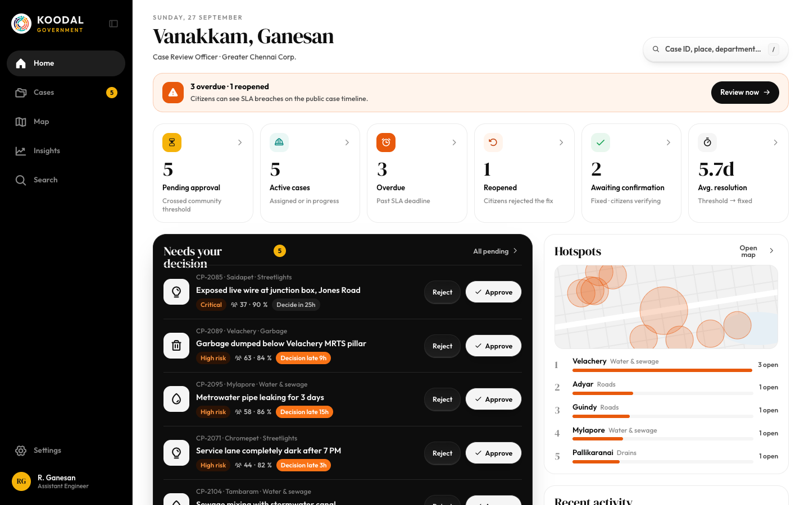
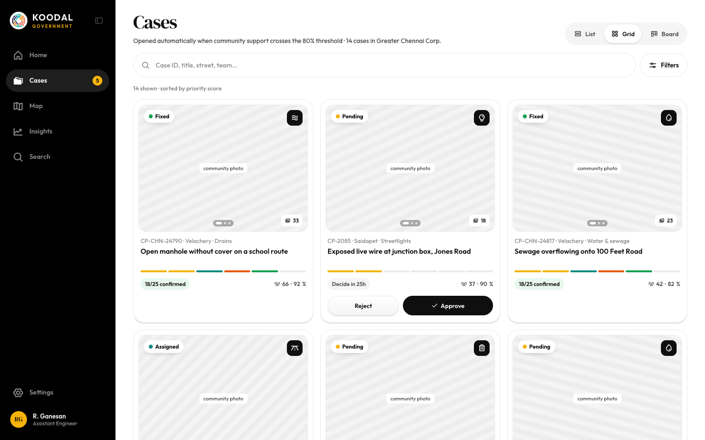
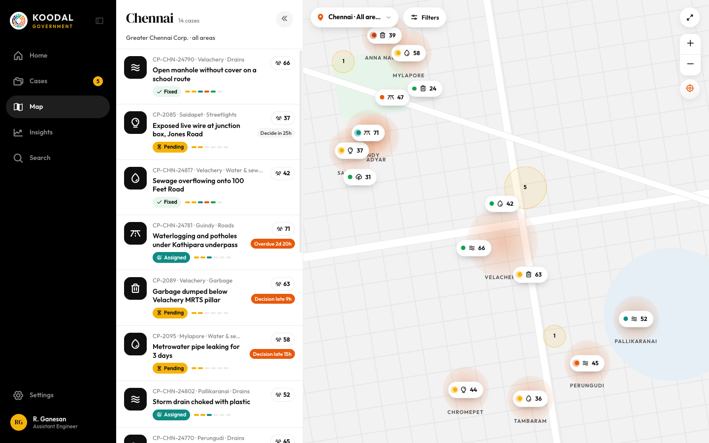

# Desktop left navigation rail

Source: `Koodal Government.dc.html`, block `<sc-if value="{{ showRail }}">`.

## Match these screenshots
-  `screenshots/gov-desktop/03-dashboard.png`
-  `screenshots/gov-desktop/04-cases-grid.png`
-  `screenshots/gov-desktop/08-case-pending-review.png`
-  `screenshots/gov-desktop/16-map.png`
-  `screenshots/gov-desktop/18-insights.png`

## Values used (from renderVals)
`showRail`, `railW`, `toggleRail`, `logoIn`, `logoOut`, `railTip`, `logoBg`, `logoCur`, `markO`, `markS`, `sideO`, `sideS`, `railLabels`, `collO`, `nav`, `goSettings`, `tr`, `setBg`, `setC`, `goProfile`, `profBg`, `me`

## Port rules
- Convert `markup.html` to JSX nearly 1:1. Keep every inline style value; `style-hover`/`style-active` → :hover/:active.
- `<sc-if value={{x}}>` → `{x && …}`; `<sc-for list={{xs}} as="x">` → `xs.map(x => …)`.
- Compute values exactly as in `logic.js`; handlers live in `../_shared/methods.js`.
- Screenshot-diff your page against the images above until < 1% difference.
