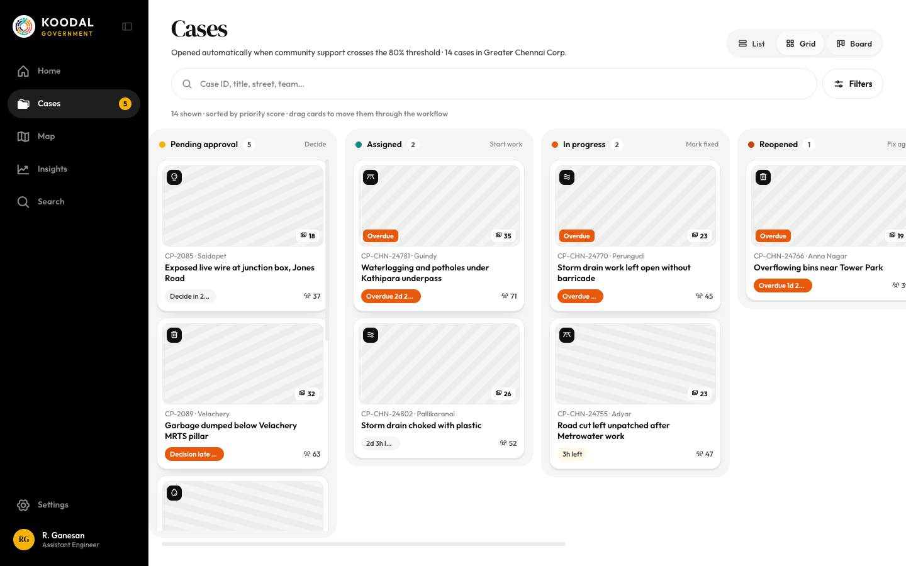
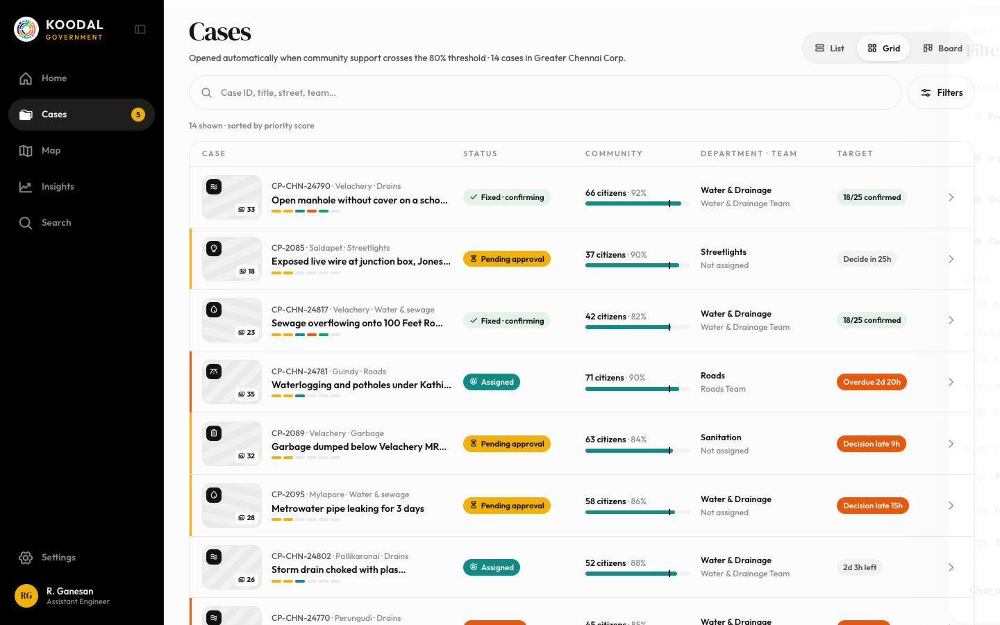

# Cases: grid / board (drag) / list

Source: `Koodal Government.dc.html`, block `<sc-if value="{{ isCases }}">`.

## Match these screenshots
-  `screenshots/gov-desktop/04-cases-grid.png`
-  `screenshots/gov-desktop/05-cases-board.png`
-  `screenshots/gov-desktop/06-cases-list.png`
-  `screenshots/gov-mobile/03-cases.png`

## Values used (from renderVals)
`isCases`, `casesMax`, `pad`, `h1`, `tr`, `casesTotal`, `corpL`, `views`, `cq`, `onCq`, `clearCq`, `openCF`, `cfBd`, `cfBg`, `cfFg`, `notMob`, `cfN`, `hasActiveF`, `activeF`, `clearF`, `listN`, `sortL`, `boardHint`, `vTable`, `rows`, `vRows`, `vGrid`, `gridMin`, `vBoard`, `negPad`, `padX`, `board`, `colW`, `boardH`, `listEmpty`

## Port rules
- Convert `markup.html` to JSX nearly 1:1. Keep every inline style value; `style-hover`/`style-active` → :hover/:active.
- `<sc-if value={{x}}>` → `{x && …}`; `<sc-for list={{xs}} as="x">` → `xs.map(x => …)`.
- Compute values exactly as in `logic.js`; handlers live in `../_shared/methods.js`.
- Screenshot-diff your page against the images above until < 1% difference.
