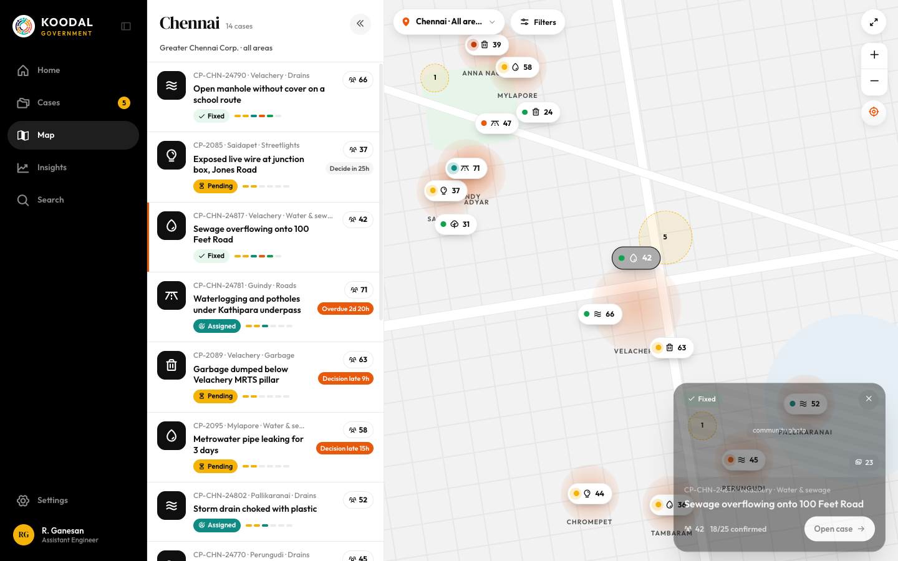
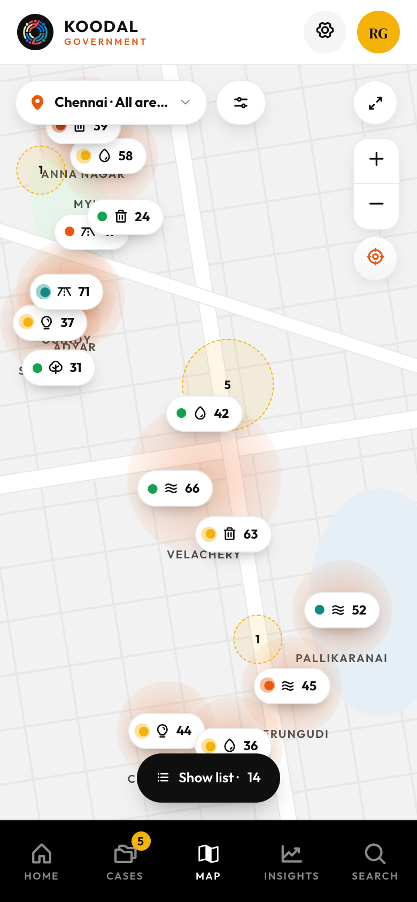

# Map incl. area/region picker

Source: `Koodal Government.dc.html`, block `<sc-if value="{{ isMap }}">`.

## Match these screenshots
-  `screenshots/gov-desktop/16-map.png`
-  `screenshots/gov-desktop/17-map-pin-selected.png`
-  `screenshots/gov-mobile/06-map.png`

## Values used (from renderVals)
`isMap`, `mapCols`, `mapH`, `notMob`, `listBd`, `regionTitle`, `mapPinN`, `toggleList`, `regionSub`, `mapRows`, `mapEmpty`, `mapDown`, `mapWheel`, `mapCur`, `panXp`, `panYp`, `zoom`, `mapTr`, `heat`, `emerg`, `pins`, `listHidden`, `listBtnL`, `openRegion`, `regionL`, `openMF`, `mfBd`, `mfBg`, `mfFg`, `mfN`, `toggleFull`, `fullTip`, `fullIcon`, `zoomIn`, `zoomOut`, `recenter`, `mobListBtn`, `mobListOpen`, `sheetH`, `sheetR`, `sheetTr`, `sheetDown`, `sheetBd`, `sheetScroll`, `sheetWheel`, `hasMapSel`, `ms`, `selR`, `selL`, `selB`, `selW`, `pvMax`, `closeSel`, `regOpen`, `closeRegion`, `mAlign`, `mJust`, `mPad`, `stop`, `mMaxW`, `mMax`, `mR`, `mAnim`, `regQ`, `onRegQ`, `regRows`, `regNone`

## Port rules
- Convert `markup.html` to JSX nearly 1:1. Keep every inline style value; `style-hover`/`style-active` → :hover/:active.
- `<sc-if value={{x}}>` → `{x && …}`; `<sc-for list={{xs}} as="x">` → `xs.map(x => …)`.
- Compute values exactly as in `logic.js`; handlers live in `../_shared/methods.js`.
- Screenshot-diff your page against the images above until < 1% difference.
