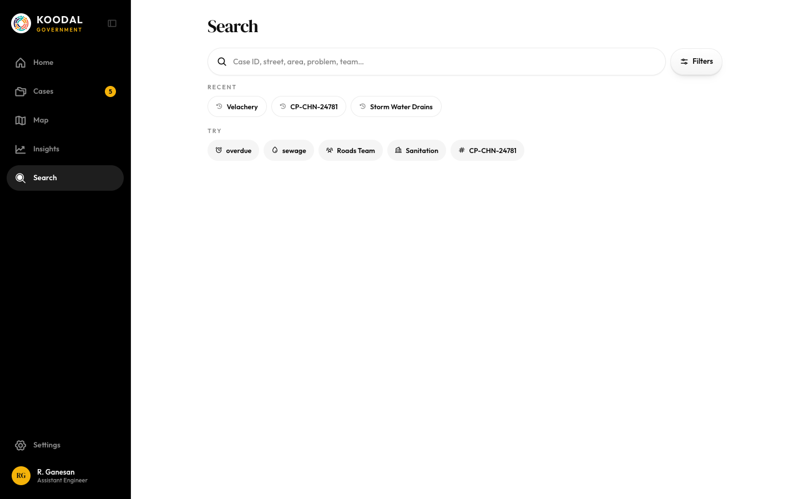

# Search

Source: `Koodal Government.dc.html`, block `<sc-if value="{{ isSearch }}">`.

## Match these screenshots
-  `screenshots/gov-desktop/19-search.png`

## Values used (from renderVals)
`isSearch`, `pad`, `sH1`, `tr`, `sRef`, `sq`, `onSq`, `onSqKey`, `clearSq`, `openCF`, `cfBd`, `cfBgS`, `cfFg`, `notMob`, `cfN`, `hasActiveF`, `activeF`, `clearF`, `sEmpty`, `recentL`, `trySugg`, `sHas`, `sCount`, `sAreasHas`, `sAreas`, `sCasesHas`, `sRows`, `sNone`

## Port rules
- Convert `markup.html` to JSX nearly 1:1. Keep every inline style value; `style-hover`/`style-active` → :hover/:active.
- `<sc-if value={{x}}>` → `{x && …}`; `<sc-for list={{xs}} as="x">` → `xs.map(x => …)`.
- Compute values exactly as in `logic.js`; handlers live in `../_shared/methods.js`.
- Screenshot-diff your page against the images above until < 1% difference.
