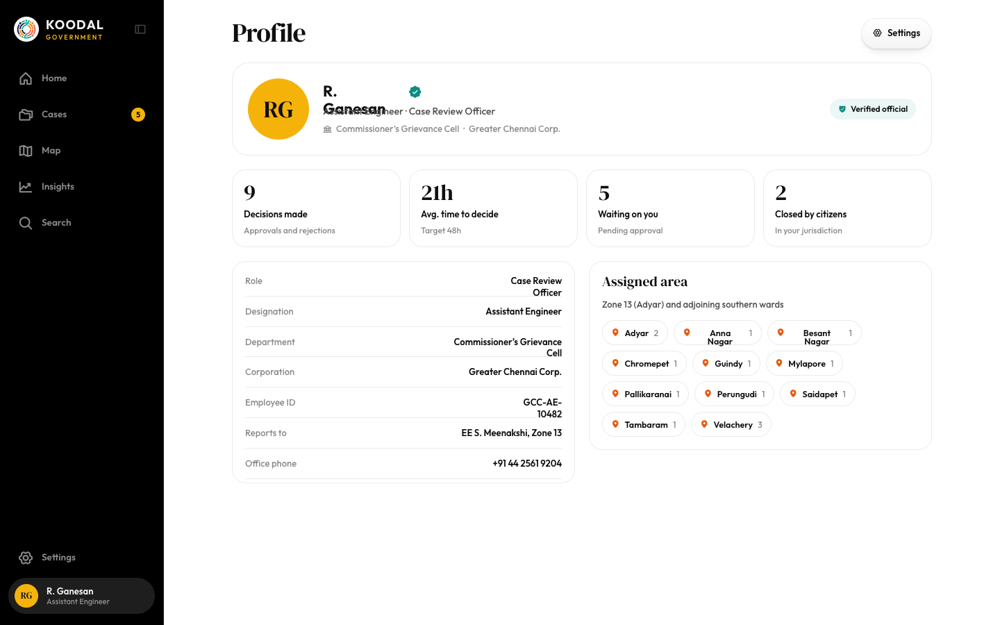

# Profile

Source: `Koodal Government.dc.html`, block `<sc-if value="{{ isProfile }}">`.

## Match these screenshots
-  `screenshots/gov-desktop/20-profile.png`

## Values used (from renderVals)
`isProfile`, `pad`, `h1`, `tr`, `goSettings`, `me`, `corpL`, `kpiMin`, `myStats`, `insCols`, `meInfo`, `meAreas`

## Port rules
- Convert `markup.html` to JSX nearly 1:1. Keep every inline style value; `style-hover`/`style-active` → :hover/:active.
- `<sc-if value={{x}}>` → `{x && …}`; `<sc-for list={{xs}} as="x">` → `xs.map(x => …)`.
- Compute values exactly as in `logic.js`; handlers live in `../_shared/methods.js`.
- Screenshot-diff your page against the images above until < 1% difference.
