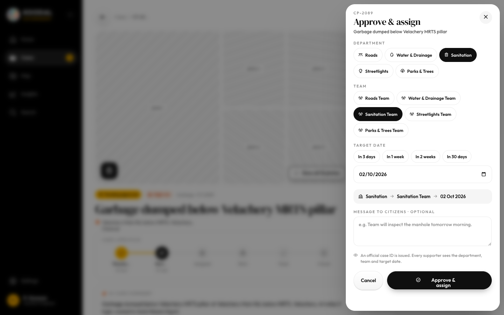
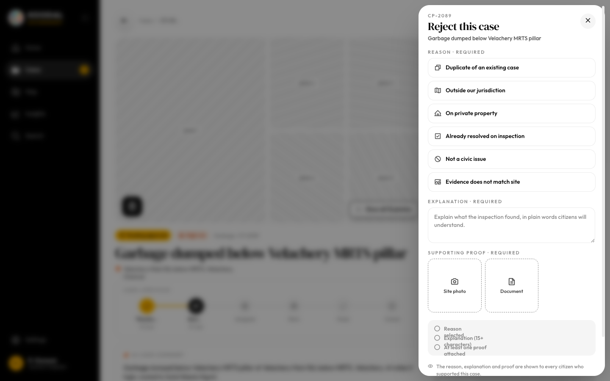
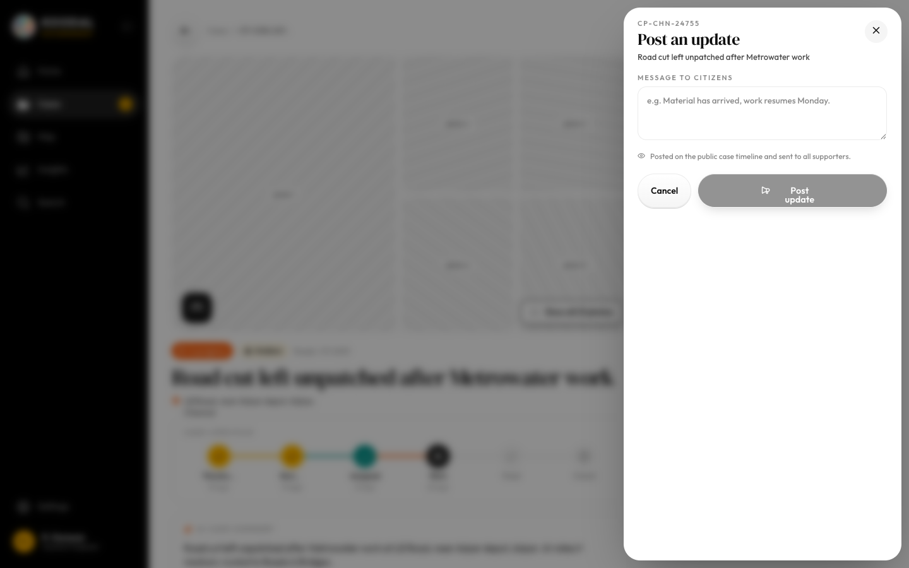
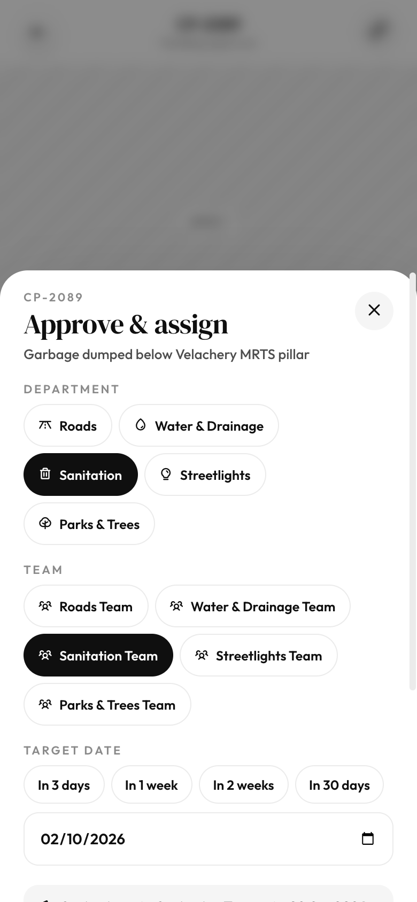

# Modals: approve & assign, reject, edit assignment, post update, mark fixed

Source: `Koodal Government.dc.html`, block `<sc-if value="{{ modalOpen }}">`.

## Match these screenshots
-  `screenshots/gov-desktop/11-modal-approve.png`
-  `screenshots/gov-desktop/12-modal-reject.png`
-  `screenshots/gov-desktop/13-modal-assign.png`
-  `screenshots/gov-desktop/14-modal-post-update.png`
-  `screenshots/gov-desktop/15-modal-mark-fixed.png`
-  `screenshots/gov-mobile/05-approve-sheet.png`

## Values used (from renderVals)
`modalOpen`, `closeModal`, `mAlign`, `mJust`, `mPad`, `stop`, `mScroll`, `mMaxW`, `mMax`, `mR`, `mAnim`, `mc`

## Port rules
- Convert `markup.html` to JSX nearly 1:1. Keep every inline style value; `style-hover`/`style-active` → :hover/:active.
- `<sc-if value={{x}}>` → `{x && …}`; `<sc-for list={{xs}} as="x">` → `xs.map(x => …)`.
- Compute values exactly as in `logic.js`; handlers live in `../_shared/methods.js`.
- Screenshot-diff your page against the images above until < 1% difference.
